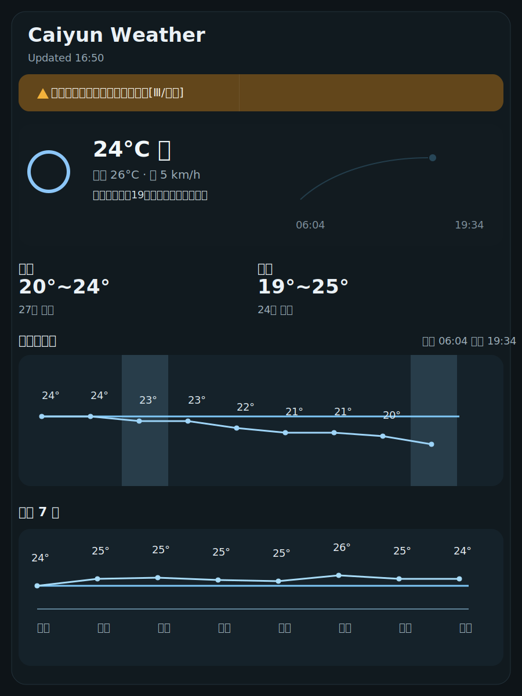

# Caiyun Weather

彩云天气插件，使用彩云天气 API 展示当前天气、告警、逐小时预报和未来 7 天预报。

## 功能

- 状态栏显示当前天气、温度和降水信息
- 弹窗展示当前实况、告警、逐小时折线图、未来 7 天折线图
- 逐小时和未来 7 天支持横向滚动
- 支持夜间暂停自动更新
- 支持手动刷新

## 配置

1. 打开插件设置
2. 填入彩云天气 `API Token`
3. 设置经纬度，或使用当前位置
4. 选择语言和刷新间隔

## 说明

- 夜间暂停更新默认关闭
- 手动刷新不受夜间暂停影响
- 插件仅依赖本地保存的设置，不会把 token 写进源码
